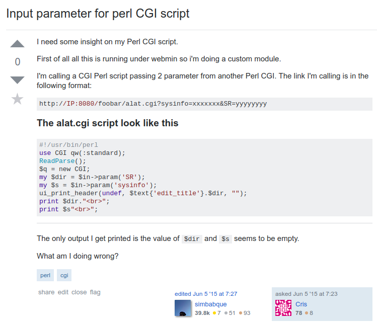
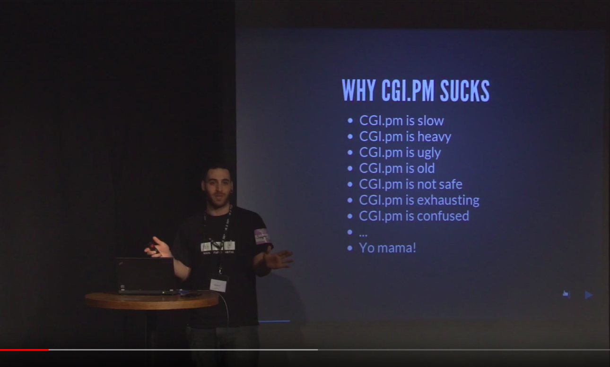

## Do stuff with `_this`

Julien Fiegehenn (simbabque)

---
You have a directory that you want to share over the web

---

but you don't have a webserver handy

---

`http_this`

written by Pedro Melo

---
What about making it secure?

---

`https_this`

written by perlancar

---

---
`cgi_this`

written by simbabque
---

---
perlancar built [https://metacpan.org/pod/Task::FooThis](https://metacpan.org/pod/Task::FooThis)

- App::HTTPThis
- App::HTTPSThis
- **App::DAVThis**
- **App::FTPThis**
- App::CGIThis

---

## Thank you!
